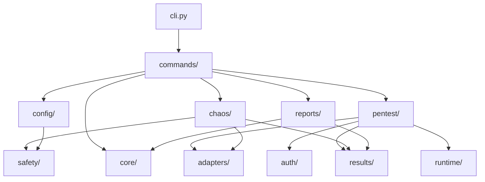
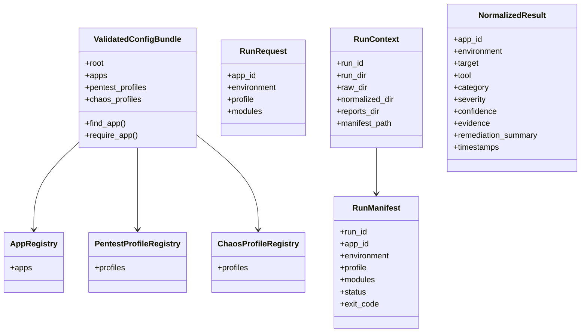
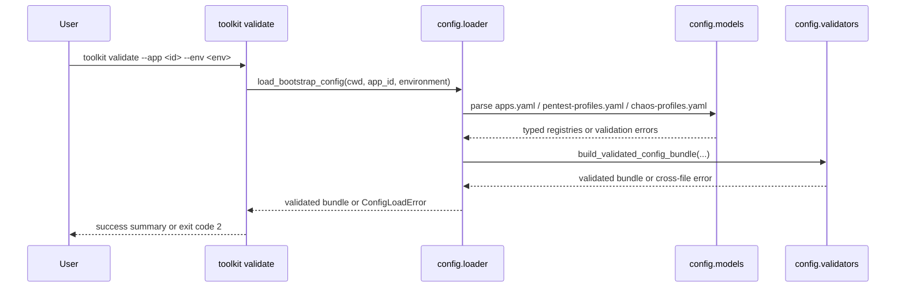
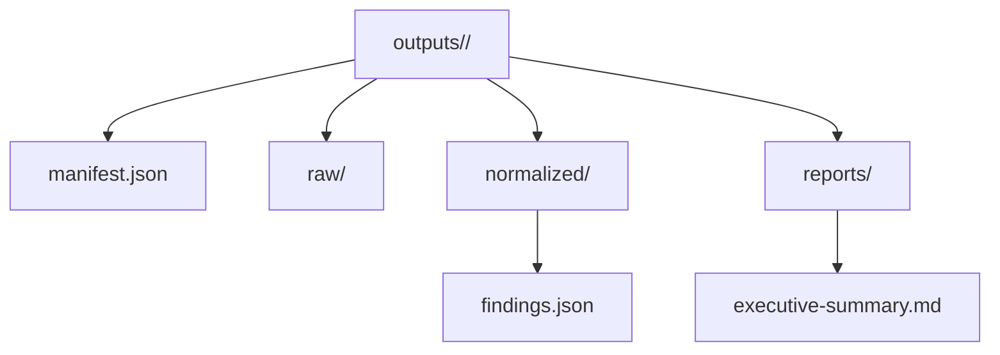

# Architecture

This document is the main system overview for the toolkit. It describes the
current implementation shape, the high-level architecture the repository is
organized around, and the core structures that move through the system.

## Overview

The toolkit is a Python-first CLI for safe internal testing in `local` and
`staging`. The architecture is intentionally split so orchestration, tool
adapters, config, and reporting remain independent and testable.

Implemented:

- CLI registration and exit-code contract
- YAML config loading, model validation, and cross-file validation
- full `run_context` module with run directory preparation, manifest writing, and stable path helpers
- normalized result model, persisted result bundles, and report rebuilding from
  stored run data
- runtime auth resolution and shared auth/session payloads
- the shared scanner adapter contract
- the shared process runner and zap, nuclei, nmap, trivy, and semgrep adapters
- pentest execution service with role-based CORE/OPTIONAL skip-versus-fail logic
- live pentest planner and orchestration runner executing real scanner binaries
- fixture-backed pentest flow preserved for onboarding and offline testing
- live chaos execution service, Toxiproxy wrapper, monitoring, and orchestration runner
- fixture-backed chaos flow preserved for onboarding and offline testing
- `runtime/` abstraction with host subprocess and Docker container backends for pentest execution

## Architectural Principles

- keep one CLI surface and one package under `src/toolkit/`
- keep config validation fail-closed and explicit
- isolate vendor tools behind adapters rather than scattering subprocess calls
- normalize results before reporting
- keep raw artifacts, normalized bundles, and rendered reports grouped by run

## System Context

The CLI is the only public entrypoint. Config files define the allowed
applications and profiles. Validation protects all later workflows by rejecting
unsafe or incomplete inputs before any tool runs.

## Package Structure

Key boundaries:

- `commands/` owns CLI registration and argument capture
- `config/` owns YAML paths, typed models, field validation, loader logic, and
  cross-file validation
- `core/` owns shared execution concepts such as exit codes and run context
- `auth/` owns runtime auth resolution and session helpers
- `adapters/` owns the scanner contract, shared process runner, and the zap, nuclei, nmap, trivy, and semgrep adapter implementations; adapters execute through the `runtime/` backend abstraction
- `pentest/` owns the live execution service, planner, and orchestration runner; the fixture-backed flow is preserved as `run_pentest_fixture_flow()` for onboarding
- `chaos/` owns the live execution service, Toxiproxy wrapper, monitoring, planner, and orchestration runner; the fixture-backed flow is preserved as `run_chaos_fixture_flow()` for onboarding
- `runtime/` owns the `RuntimeBackend` protocol, host subprocess backend, and Docker container backend; pentest execution routes through the selected backend
- `compose/` owns the Docker Compose workflow contract (service names, mount paths, network model); the root `docker-compose.yml` and `compose/` assets implement that contract for the Docker-first operator path
- `results/` owns normalized finding contracts
- `reports/` owns rendered outputs
- `safety/` owns fail-closed checks shared across workflows

## Underlying Tool Roles

The toolkit is an orchestration layer. These are the main external tools it
drives directly:

- scanners produce findings
- runtime helpers shape scope, auth, connectivity, or fault injection
- Docker is the only container runtime in the current implementation
- no separate testing utility participates in live scan execution

| Tool | Used for | Role in workflow | Type |
|---|---|---|---|
| `httpx` | preflight HTTP requests, auth requests, health/metrics probes | fingerprints URL audit targets, helps bootstrap auth, and supports chaos monitoring | runtime helper |
| `katana` | route discovery | expands same-origin audit scope before the main scanners run | runtime helper |
| `ZAP` | safe web security checks | primary DAST scanner for URL audit and config-driven pentest runs | scanner |
| `Nuclei` | template-based HTTP exposure checks | secondary web scanner across a bounded route set | scanner |
| `Nmap` | conservative host and service inspection | adds host/service context to audit and pentest runs | scanner |
| `Semgrep` | source-code rule matching | static analysis engine for `toolkit code-audit` and optional profile-driven code checks | scanner |
| `Trivy` | filesystem, dependency, config, and secret checks | static analysis engine for `toolkit code-audit` and optional profile-driven artifact checks | scanner |
| `Toxiproxy` | reversible proxy fault injection | powers `toolkit edge-chaos` and `toolkit chaos run` experiments | runtime helper |
| `Docker` | containerized tool execution | provides the `container` backend when scanners are not run as host binaries | container runtime |

`uv` is the package manager and command runner used to start the toolkit
locally, for example `uv run toolkit ...`. It is not part of the scanning
toolchain.

## Runtime Structures

The most important runtime objects are configuration bundles, run metadata, and
normalized results.

Structure notes:

- config registries describe allowed applications and profiles
- the validated bundle is the handoff from config parsing into command logic
- `RunRequest` is the stable input for creating a run directory
- `RunContext` resolves the per-run filesystem layout under `outputs/`
- `RunManifest` records run metadata independently from tool output
- `NormalizedResult` is the shared reporting shape across tools

For artifact layout details, see [output-artifacts.md](./output-artifacts.md).

## Validation Flow

The implemented validation path is the current backbone of the system.

This flow is intentionally strict because all future execution paths depend on
it. If validation is ambiguous or permissive, later scanner and chaos behavior
cannot be made safe by construction.

## Run Artifact Structure

The run workspace is implemented and in use by the fixture-backed pentest flow.

This structure separates vendor-specific raw output from the normalized data
and the human-facing summary. That separation keeps report generation stable
even when underlying tools differ.

## Current State And Planned Expansion

Current state:

- `toolkit validate` is implemented end-to-end for config validation
- `toolkit pentest run` executes real scanner binaries (zap, nuclei, nmap)
  against a live target; fixture-backed flow preserved for onboarding and testing
- `toolkit chaos run` executes live Toxiproxy-backed experiments; fixture-backed
  flow preserved for onboarding and testing
- `toolkit report build` is implemented for existing normalized result bundles
- config validation, run-context structure, pentest orchestration, chaos
  orchestration, and report rebuilding are the main implemented foundations

Both pentest and chaos paths now execute against live targets. Fixture-backed
flows are preserved for onboarding, offline testing, and CI without external
dependencies.

See also:

- `docs/explanation/safety-model.md` for fixture-backed boundary rationale and
  guardrails
- `examples/configs/sample-webapp/` and `examples/configs/sample-api/` for
  sanitized operator config packs
