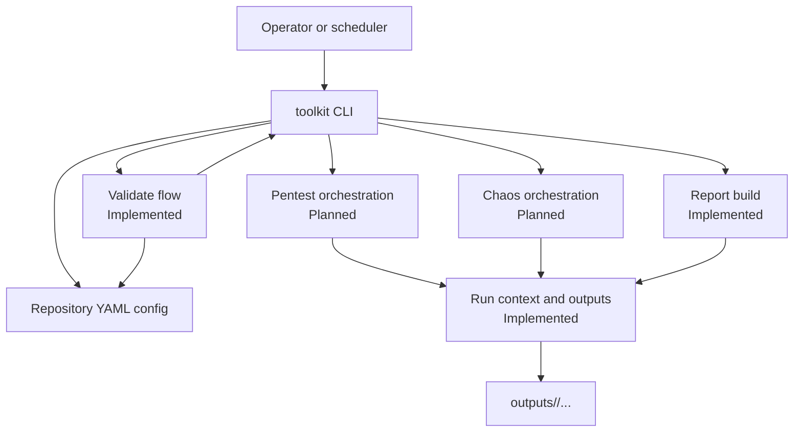
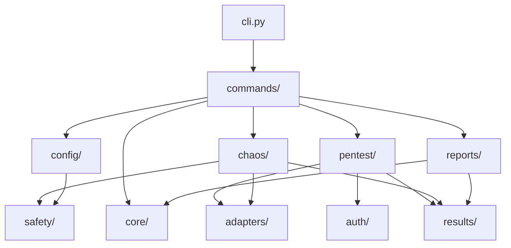
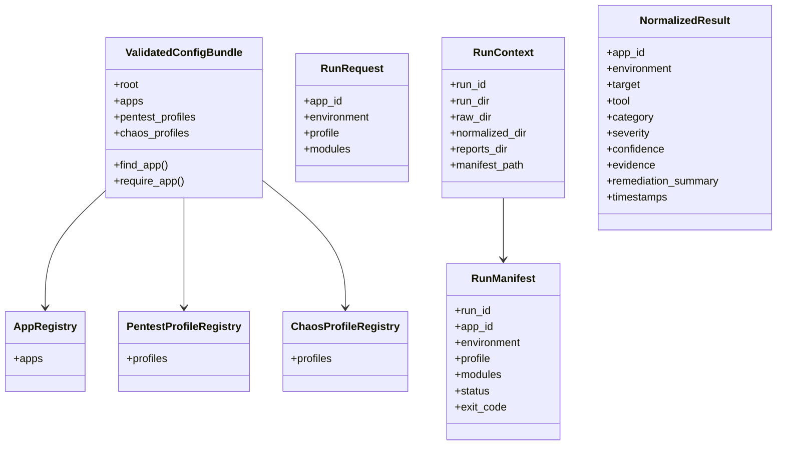
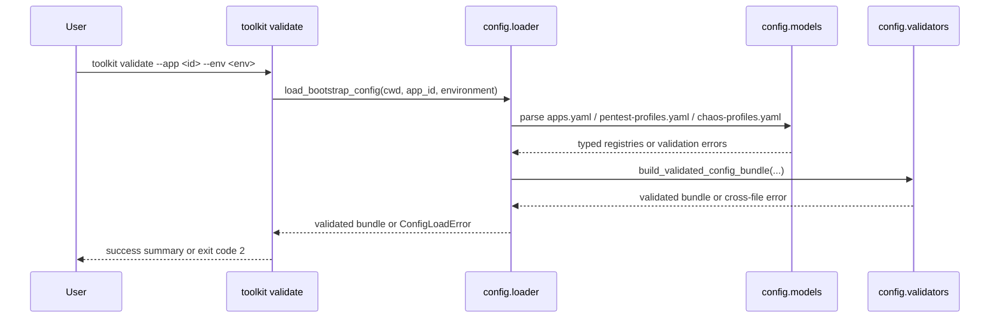
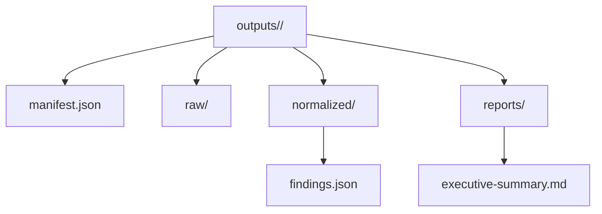

# Architecture

This document is the main system overview for the toolkit. It describes the
current implementation shape, the high-level architecture the repository is
organized around, and the core structures that move through the system.

## Overview

The toolkit is a Python-first CLI for safe internal testing in `local` and
`staging`. The current implementation has two real command paths —
`toolkit validate` and `toolkit report build` — with scaffolding for the
future `pentest` and `chaos` workflows. The architecture is intentionally
split early so later scanner and chaos integrations do not collapse into
shell-heavy code.

Implemented now:

- CLI registration and exit-code contract
- YAML config loading, model validation, and cross-file validation
- full `run_context` module with run directory preparation, manifest writing, and stable path helpers
- normalized result model, persisted result bundles, and report rebuilding from
  stored run data

Planned next:

- pentest orchestration through external tool adapters
- chaos orchestration through safe proxy-based experiments

## Architectural Principles

- keep one CLI surface and one package under `src/toolkit/`
- keep config validation fail-closed and explicit
- isolate vendor tools behind adapters rather than scattering subprocess calls
- normalize results before reporting
- keep raw artifacts, normalized bundles, and rendered reports grouped by run

## System Context

The CLI is the only public entrypoint. Config files define the allowed
applications and profiles. Validation protects all later workflows by rejecting
unsafe or incomplete inputs before any tool runs.

## Package Structure

Key boundaries:

- `commands/` owns CLI registration and argument capture
- `config/` owns YAML paths, typed models, field validation, loader logic, and
  cross-file validation
- `core/` owns shared execution concepts such as exit codes and run context
- `auth/` owns runtime auth resolution and session helpers
- `adapters/` will own external tool boundaries
- `pentest/` and `chaos/` will own orchestration flows
- `results/` owns normalized finding contracts
- `reports/` owns rendered outputs
- `safety/` owns fail-closed checks shared across workflows

## Runtime Structures

The most important runtime objects are configuration bundles, run metadata, and
normalized results.

Structure notes:

- config registries describe allowed applications and profiles
- the validated bundle is the handoff from config parsing into command logic
- `RunRequest` is the stable input for creating a run directory
- `RunContext` resolves the per-run filesystem layout under `outputs/`
- `RunManifest` records run metadata independently from tool output
- `NormalizedResult` is the shared reporting shape across tools

For artifact layout details, see [output-artifacts.md](./output-artifacts.md).

## Validation Flow

The implemented validation path is the current backbone of the system.

This flow is intentionally strict because all future execution paths depend on
it. If validation is ambiguous or permissive, later scanner and chaos behavior
cannot be made safe by construction.

## Run Artifact Structure

The planned run workspace is already fixed even though the execution flows are
not yet complete.

This structure separates vendor-specific raw output from the normalized data
and the human-facing summary. That separation keeps report generation stable
even when underlying tools differ.

## Current State And Planned Expansion

Current state:

- `toolkit validate` is implemented end-to-end for config validation
- `toolkit report build` is implemented for existing normalized result bundles
- `toolkit pentest run` and `toolkit chaos run` remain scaffold-only
- config validation, run-context structure, and report rebuilding are the main
  implemented foundations

Planned expansion:

- `results/io` and report loading/writing for persisted bundles
- safe adapters for ZAP, Nuclei, Nmap, and optional Trivy/Semgrep
- pentest orchestration that writes raw artifacts and normalized findings
- chaos orchestration that records baseline, fault execution, rollback, and
  recovery state
